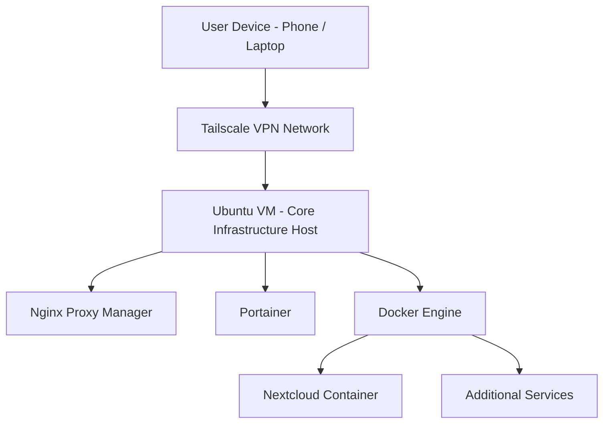

# Self-Hosted Cloud Infrastructure (Docker + VPN + Virtualization Lab)

## Overview

This project is a self-hosted private cloud infrastructure built using Linux virtualization, containerization, and secure mesh networking.

It replicates core enterprise IT and cloud infrastructure concepts including secure remote access, service orchestration, reverse proxy routing, and modular virtualization. The environment is designed as a hands-on systems and cybersecurity lab for infrastructure engineering practice.

The system emphasizes secure-by-design architecture with no public port exposure and VPN-only remote access.

---

## Key Features

- Secure remote access via zero-trust VPN (no public port exposure)
- Self-hosted private cloud storage system
- Reverse proxy routing for service management
- Containerized application deployment and orchestration
- Modular multi-service architecture
- Expansion-ready SIEM and Active Directory simulation environment

---

## Tech Stack

- Ubuntu Server (Linux)
- Docker & Docker Compose
- Nginx Proxy Manager
- Nextcloud
- Portainer
- Tailscale (zero-trust VPN mesh networking)
- VirtualBox (lab virtualization environment)

:contentReference[oaicite:0]{index=0}  
:contentReference[oaicite:1]{index=1}  

---

## Architecture

## Virtual Machine Design

### VM 1 — Core Infrastructure (Current)
- Docker host system
- Reverse proxy (Nginx Proxy Manager)
- Container management (Portainer)

### VM 2 — Cloud Storage (Current/Planned)
- Nextcloud deployment
- File synchronization system
- Multi-user storage simulation

### VM 3 — Security Lab (Planned)
- SIEM deployment (Wazuh)
- Log aggregation and monitoring
- Security event analysis

### VM 4 — Active Directory Lab (Planned)
- Windows Server domain controller
- Identity and access management simulation

### VM 5 — Client Simulation (Planned)
- Windows 10/11 endpoint
- Enterprise workstation environment

## Learning Outcomes

- Linux system administration
- Docker container orchestration
- Reverse proxy architecture design
- VPN-based networking (zero-trust model)
- Multi-layer infrastructure troubleshooting
- Enterprise system simulation design
